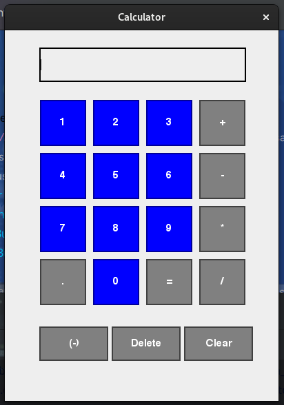

<div align="center">

# Calculator




  


------------


**| [Overview](#overview) | [Key Features](#key-features) | [User Manual](#user-manual) | [Ongoing Improvements and Known Bugs](#ongoing-improvements-and-known-bugs) | [Found a Bug?](#found-a-bug) |**


------------


## Overview
This project is a basic calculator application built using Java Swing. It provides users with a simple, intuitive graphical interface to perform fundamental arithmetic operations such as addition, subtraction, multiplication, and division, along with support for decimal numbers and negative values.


------------


## Key Features
##### Basic Arithmetic Operations
###### Supports essential mathematical functions like addition, subtraction, multiplication, and division.
##### Decimal Point Support
######  Handles calculations with decimal numbers using a dedicated decimal button.
##### Negative Number Toggle
######  Includes a button to easily toggle between positive and negative values during calculations.
##### Instant Calculation Results
###### Displays results in real-time as users enter numbers and operators.
##### Clear and Delete Functions
###### Allows users to clear the screen or delete individual digits for flexible input correction.


------------


## User Manual
</div>

####  Requirements
###### Java Version
The game requires `Java 8` or higher to run. You can check your `Java` version by running below command:
```bash
$ java -version
```

#### Getting Started
###### To run a program, you need to:
- Clone this repository
 ```bash
$ git clone <repository_url>
```
###### If you're using the executable file:
- Double-click the executable file (`Mini_Calculator.jar`) to launch the game.
- If the executable does not open via double-click, run the following command from the terminal/command prompt:
```bash
$  ./calculator
```
###### If you're running from Source Code
- Open the project in your preferred  `IDE` (e.g. IntelliJ IDEA, Eclipse).
- Run the `Main.java` class located in the `src` package to launch the program.


##### Customization
###### Modifying the User Interface
The layout and appearance of the calculator can be customized by adjusting the `Swing` components in the `Calculator` class:

**Steps to make the change:**
1. To change button sizes, modify the `setBounds()` values for each button (e.g., `negButton.setBounds(50, 430, 100, 50)`).
2. To alter the font, modify the `Font` object. For example, adjust the size or style of the font object:
```java
$ Font font = new Font("Helvetica", Font.BOLD, 18);
```

###### Adding New Buttons
You can add additional functionalities (like square root or exponentiation).

**Steps to make the change:**
1. Create a new button in the `Calculator` constructor:
```java
JButton sqrtButton = new JButton("√");
sqrtButton.setFont(font);
sqrtButton.setBackground(Color.GRAY);
sqrtButton.setBorder(BorderFactory.createLineBorder(Color.DARK_GRAY, 2));
sqrtButton.setForeground(Color.WHITE);
sqrtButton.setFocusable(false);
sqrtButton.addActionListener(this);
frame.add(sqrtButton);
```
2. Position the button by setting its bounds and adding it to the panel or directly to the frame (as done with other buttons).
3. Add functionality for the new button in `the actionPerformed()` method:
```java
if (actionEvent.getSource() == sqrtButton) 
{
    num1 = Double.parseDouble(textField.getText());
    result = Math.sqrt(num1);
    textField.setText(String.valueOf(result));
}
```

------------
<div align="center">

## Ongoing Improvements and Known Bugs

| # | Name                            | Type             | Description                                                                                                     |
|---|---------------------------------|------------------|-----------------------------------------------------------------------------------------------------------------|
| 1 | Memory Functions                | Work in progress | Implementing memory-related features (`M+`, `M-`, `MC`) to store and reuse results from previous calculations.        |
| 2 | Advanced Mathematical Functions | Work in progress | Currently working on adding additional operations such as square root (`√`), exponentiation (`^`), and modulus (`%`). |


------------

## Found a bug?

If you encounter any issues or bugs while using this project, please feel free to open an issue in the Issues section of the repository. Make sure to describe the bug in detail, providing steps to reproduce, expected behavior, and any relevant logs or screenshots.

If you'd like to contribute a fix for the issue, you're welcome to submit a pull request (PR). When submitting a PR, please reference the issue number and provide a description of the changes made.

------------

</div>


