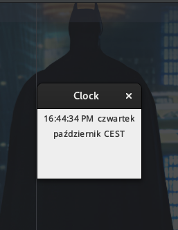

<div align="center">

# Clock




  


------------


**| [Overview](#overview) | [Key Features](#key-features) | [User Manual](#user-manual) | [Ongoing Improvements and Known Bugs](#ongoing-improvements-and-known-bugs) | [Found a Bug?](#found-a-bug) |**


------------


## Overview
A basic clock application that shows the current time, day, month, and time zone. It updates every second, leveraging Java's SimpleDateFormat and Calendar classes to format and display the information.

------------


## Key Features
##### Day and Month Display
###### Shows the current day of the week and month, formatted for easy reading.
##### Time Zone Information
###### The application includes the current time zone in the display, making it easier to track time across regions.
##### Thread-Based Time Updates
###### Uses a thread to refresh the time every second without freezing the user interface.
##### Swing-Based GUI
######  Built using Java's Swing library, the graphical interface is responsive and efficient.
##### Compact, Non-Resizable Window
###### The clock is presented in a fixed-size window, preventing resizing and keeping the layout intact.


------------


## User Manual
</div>

####  Requirements
###### Java Version
The game requires `Java 8` or higher to run. You can check your `Java` version by running below command:
```bash
$ java -version
```

#### Getting Started
###### To run a program, you need to:
- Clone this repository
 ```bash
$ git clone <repository_url>
```
###### If you're using the executable file:
- Navigate to the repository's `releases` folder where the executable file is located.
- Double-click the executable file (`clock.jar`) to launch the game.
- If the executable does not open via double-click, run the following command from the terminal/command prompt:
```bash
$  ./clock
```
###### If you're running from Source Code
- Open the project in your preferred  `IDE` (e.g. IntelliJ IDEA, Eclipse).
- Run the `Main.java` class located in the `src` package to launch the program.


##### Customization
###### Changing the Clock Format
The time, day, month, and time zone formats can be customized by modifying the `SimpleDateFormat` patterns in the `MyFrame` class.

**Steps to make the change:**
1. To change the time format, adjust the `timeFormat` object. For example, to use a 24-hour clock format:
```java
$ timeFormat = new SimpleDateFormat("HH:mm:ss");
```
2. You can also modify the day or month format by updating `dayFormat` and `monthFormat`:
```java
 // Short format for day (e.g., "Mon")
$ dayFormat = new SimpleDateFormat("EEE"); 
// Short format for month (e.g., "Oct")
$ monthFormat = new SimpleDateFormat("MMM");  
```


------------
<div align="center">

## Ongoing Improvements and Known Bugs

##### So Far So Good


------------

## Found a bug?

If you encounter any issues or bugs while using this project, please feel free to open an issue in the Issues section of the repository. Make sure to describe the bug in detail, providing steps to reproduce, expected behavior, and any relevant logs or screenshots.

If you'd like to contribute a fix for the issue, you're welcome to submit a pull request (PR). When submitting a PR, please reference the issue number and provide a description of the changes made.

------------

</div>


