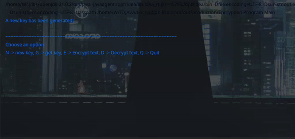

<div align="center">

# Text Encryption




    


------------


**| [Overview](#overview) | [Key Features](#key-features) | [User Manual](#user-manual) | [Ongoing Improvements and Known Bugs](#ongoing-improvements-and-known-bugs) | [Found a Bug?](#found-a-bug) |**


------------


## Overview
This project implements a character-based encryption and decryption mechanism using shuffled ASCII characters, offering a simple yet effective way to secure text data via the console interface.

------------


## Key Features
##### Interactive Console Interface
###### The program features an easy-to-use command-line interface, allowing users to select options for encryption, decryption, and key generation.
##### Randomized Key Generation
###### Every new session generates a completely unique, randomized key for encoding and decoding messages.
##### Text Encryption
###### Users can input text to encrypt, which is then scrambled using the randomized key for secure message encoding.
##### Text Decryption
######  The program decrypts encoded messages using the same shuffled key, returning the original readable text.
##### Key Display Option
###### Users can retrieve and view both the original and shuffled keys used for encryption and decryption.


------------


## User Manual
</div>

####  Requirements
###### Java Version
The game requires `Java 8` or higher to run. You can check your `Java` version by running below command:
```bash
$ java -version
```

#### Getting Started
###### To run a program, you need to:
- Clone this repository
 ```bash
$ git clone <repository_url>
```
###### If you're using the executable file:
- Navigate to the repository's `releases` folder where the executable file is located.
- Double-click the executable file (`encrypt.jar`) to launch the game.
- If the executable does not open via double-click, run the following command from the terminal/command prompt:
```bash
$  ./encrypt
```
###### If you're running from Source Code
- Open the project in your preferred  `IDE` (e.g. IntelliJ IDEA, Eclipse).
- Run the `Main.java` class located in the `src` package to launch the program.


##### Customization
###### Changing the Encryption Key Range
By default, the program uses ASCII characters ranging from 32 to 126 for encryption. 

**Steps to make the change:**
1. In the newKey() method of the Encryption class, change the loop that generates the character list:
```java
$ for (int i = 32; i < 127; i++)
{
// Adjust the range to include different characters
    list.add(Character.valueOf(character));
    character++;
}
```
This allows you to include more or fewer characters in the encryption process, based on your needs.


------------
<div align="center">

## Ongoing Improvements and Known Bugs

##### So Far So Good


------------

## Found a bug?

If you encounter any issues or bugs while using this project, please feel free to open an issue in the Issues section of the repository. Make sure to describe the bug in detail, providing steps to reproduce, expected behavior, and any relevant logs or screenshots.

If you'd like to contribute a fix for the issue, you're welcome to submit a pull request (PR). When submitting a PR, please reference the issue number and provide a description of the changes made.

------------

</div>


