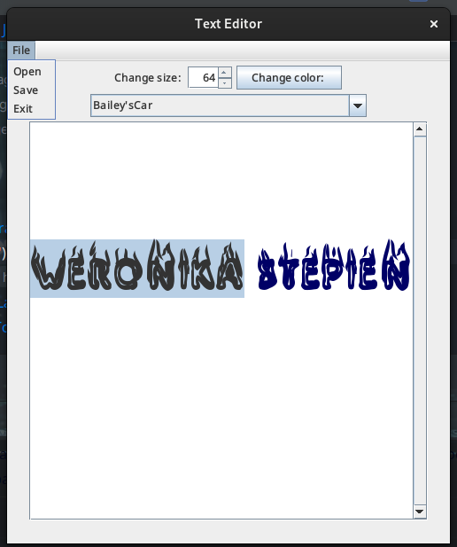

<div align="center">

# Text Editor




   


------------


**| [Overview](#overview) | [Key Features](#key-features) | [User Manual](#user-manual) | [Ongoing Improvements and Known Bugs](#ongoing-improvements-and-known-bugs) | [Found a Bug?](#found-a-bug) |**


------------


## Overview
This project provides a basic text editor with the ability to open and save files, adjust font properties, and change text color. The editor is built using Java Swing and includes a menu bar for easy navigation.

------------


## Key Features
##### Open Text Files
###### Users can open .txt files directly from their system and edit the contents within the application.
##### Save Text Files
###### The editor allows users to save their work by writing the contents of the text area to a .txt file.
##### Adjust Font Size
###### The built-in font size spinner lets users easily increase or decrease the font size for better readability.
##### Change Font Color
######  The editor includes a color picker that allows users to change the color of the text to any color of their choice.
##### Select Different Fonts
######  Users can select from a wide variety of fonts provided by the system, offering customization in text appearance.
##### Scrollable Text Area
###### The text area is equipped with a scroll pane, allowing users to work with longer documents without losing track of the text.
##### Line Wrap Feature
###### Text automatically wraps to the next line when it reaches the edge of the window, making long text easier to read.


------------


## User Manual
</div>

####  Requirements
###### Java Version
The game requires `Java 8` or higher to run. You can check your `Java` version by running below command:
```bash
$ java -version
```

#### Getting Started
###### To run a program, you need to:
- Clone this repository
 ```bash
$ git clone <repository_url>
```
###### If you're using the executable file:
- Double-click the executable file (`Mini_Text_Editor.jar`) to launch the game.
- If the executable does not open via double-click, run the following command from the terminal/command prompt:
```bash
$  ./txtEdit
```
###### If you're running from Source Code
- Open the project in your preferred  `IDE` (e.g. IntelliJ IDEA, Eclipse).
- Run the `Main.java` class located in the `src` package to launch the program.


------------
<div align="center">

## Ongoing Improvements and Known Bugs

##### So Far So Good


------------

## Found a bug?

If you encounter any issues or bugs while using this project, please feel free to open an issue in the Issues section of the repository. Make sure to describe the bug in detail, providing steps to reproduce, expected behavior, and any relevant logs or screenshots.

If you'd like to contribute a fix for the issue, you're welcome to submit a pull request (PR). When submitting a PR, please reference the issue number and provide a description of the changes made.

------------

</div>


