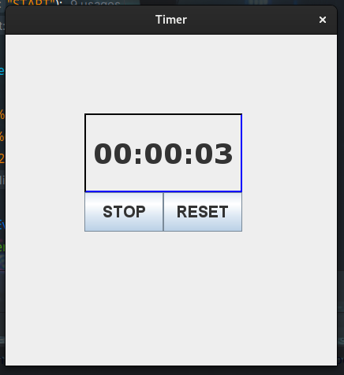

<div align="center">

# Timer




   


------------


**| [Overview](#overview) | [Key Features](#key-features) | [User Manual](#user-manual) | [Ongoing Improvements and Known Bugs](#ongoing-improvements-and-known-bugs) | [Found a Bug?](#found-a-bug) |**


------------


## Overview
This project is a minimalistic stopwatch built using Java's Swing library. It features a user interface with clear controls for starting, stopping, and resetting the timer, which displays hours, minutes, and seconds.

------------


## Key Features
##### Start and Stop Functionality
###### The stopwatch allows users to easily start and stop the timer with a single click of the "START" or "STOP" button.
##### Reset Timer
###### The stopwatch includes a "RESET" button, allowing users to quickly reset the timer back to zero.
##### Real-Time Time Tracking
###### The application updates the timer every second, displaying elapsed time in hours, minutes, and seconds.
##### Simple Graphical User Interface
######  The stopwatch features a clean, easy-to-use graphical interface built with Java Swing.
##### Formatted Time Display
######  The time is displayed in a well-formatted hours:minutes
layout, ensuring clarity for the user.
##### Toggle Between Start and Stop
###### The start button automatically switches to "STOP" when the timer is running, making it intuitive to pause and resume the timer.


------------


## User Manual
</div>

####  Requirements
###### Java Version
The game requires `Java 8` or higher to run. You can check your `Java` version by running below command:
```bash
$ java -version
```

#### Getting Started
###### To run a program, you need to:
- Clone this repository
 ```bash
$ git clone <repository_url>
```
###### If you're using the executable file:
- Navigate to the repository's `releases` folder where the executable file is located.
- Double-click the executable file (`timer.jar`) to launch the game.
- If the executable does not open via double-click, run the following command from the terminal/command prompt:
```bash
$  ./timer
```
###### If you're running from Source Code
- Open the project in your preferred  `IDE` (e.g. IntelliJ IDEA, Eclipse).
- Run the `Main.java` class located in the `src` package to launch the program.


------------
<div align="center">

## Ongoing Improvements and Known Bugs

##### So Far So Good


------------

## Found a bug?

If you encounter any issues or bugs while using this project, please feel free to open an issue in the Issues section of the repository. Make sure to describe the bug in detail, providing steps to reproduce, expected behavior, and any relevant logs or screenshots.

If you'd like to contribute a fix for the issue, you're welcome to submit a pull request (PR). When submitting a PR, please reference the issue number and provide a description of the changes made.

------------

</div>


