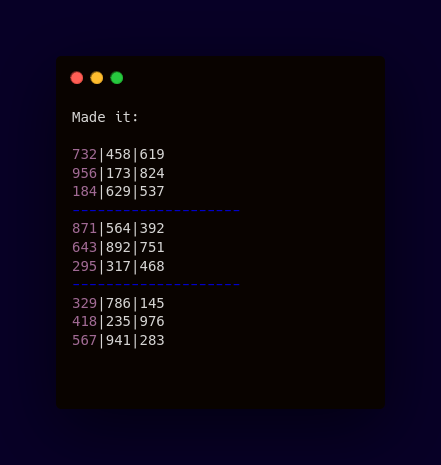

<div align="center">

# Sudoku Solver
#### Backtracking algorithm to solve a 9x9 Sudoku puzzle




  


------------


**| [Overview](#overview) | [Key Features](#key-features) | [User Manual](#user-manual) | [Ongoing Improvements and Known Bugs](#ongoing-improvements-and-known-bugs) | [Found a Bug?](#found-a-bug) |**


------------


## Overview
The goal of this project is to solve a Sudoku puzzle using recursion and backtracking. It attempts to place numbers from 1 to 9 into a grid while ensuring no violations of the puzzle's rules in rows, columns, and subgrids.


------------


## Key Features
##### Recursive Backtracking
###### Utilizes a recursive approach to fill the puzzle grid while maintaining Sudoku's rules.
##### Grid Validation
###### Ensures that all numbers placed follow Sudoku constraints, checking rows, columns, and subgrids.
##### Input Flexibility
###### Supports customizable Sudoku puzzles with an easy-to-modify 2D array representing the board.
##### Conflict Detection
###### Detects conflicts in number placement and corrects them through the backtracking mechanism.
##### Zero-Based Empty Cell Handling
###### Uses zeros to represent empty cells on the Sudoku grid, which the algorithm attempts to solve.
##### Visual Board Output
###### Provides a method to print the board for easy visualization of the Sudoku puzzle before and after solving.


------------


## User Manual
</div>

####  Requirements
###### Java Version
The game requires `Java 8` or higher to run. You can check your `Java` version by running below command:
```bash
$ java -version
```

#### Getting Started
###### To run a program, you need to:
- Clone this repository
 ```bash
$ git clone <repository_url>
```
- Open the project in your preferred `Java IDE` (e.g., IntelliJ IDEA, Eclipse).
- Run the `Main.java` class located in the `src` package to launch the game.


------------
<div align="center">


## Ongoing Improvements and Known Bugs

| # | Name   | Type             | Description                                                                                                                           |
|---|--------|------------------|---------------------------------------------------------------------------------------------------------------------------------------|
| 1 | GUI    | Work in progress | Considering the integration of a simple GUI to allow users to interact with the Sudoku solver visually, making it more user-friendly. |
| 2 | Errors | Bug              | For very complex puzzles, there may be stack overflow issues due to deep recursion in the backtracking algorithm.                     |


------------

## Found a bug?

If you encounter any issues or bugs while using this project, please feel free to open an issue in the Issues section of the repository. Make sure to describe the bug in detail, providing steps to reproduce, expected behavior, and any relevant logs or screenshots.

If you'd like to contribute a fix for the issue, you're welcome to submit a pull request (PR). When submitting a PR, please reference the issue number and provide a description of the changes made.


------------
</div>


